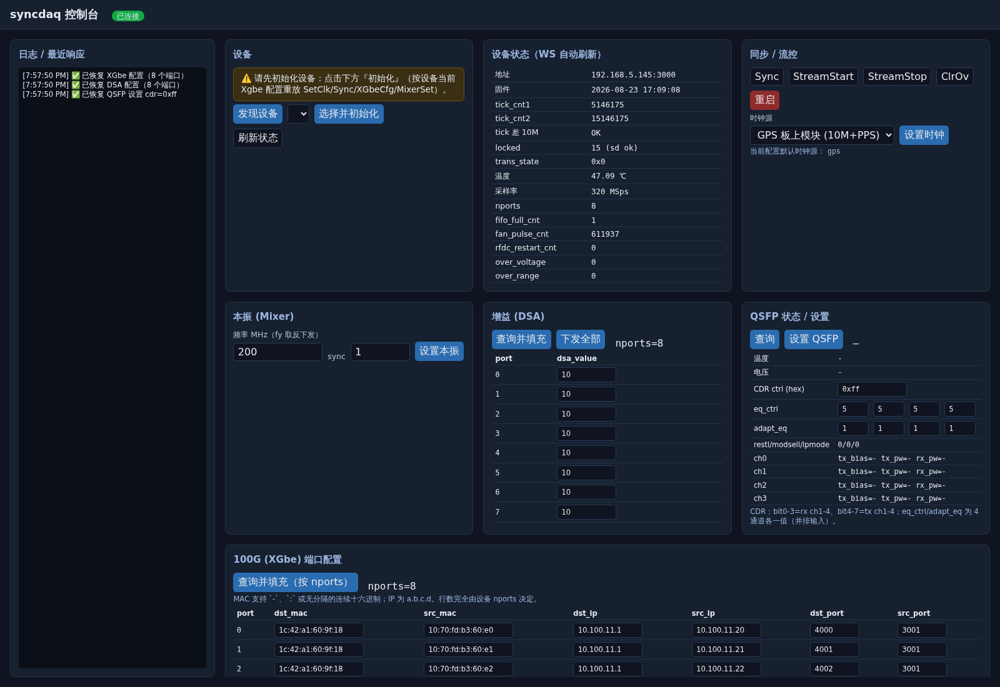

# syncdaq_web

`syncdaq` 数据采集设备的 **Web 控制台**（Rust + axum + WebSocket + Askama 单页前端）。它把「设备发现、初始化、状态监控、各功能控制、以及抓取一小段数据做光谱/直方图」集中到一个浏览器界面里。



## 功能

- **设备发现与选择**：向网口广播 `Query` 自动发现设备，选中即设为当前设备。
- **一键初始化**：按“设备当前 XGbe 配置”重放 `SetClk + Sync + XGbeCfgSingle×8 + MixerSet`（时钟源、本振可配置）。命令**逐个执行、逐条经 WebSocket 推送到日志**。
- **状态监控**：`Query` 解析（固件版本、tick、locked、温度、采样率、nports、trans_state 等），WebSocket 自动刷新。
- **控制面板**：
  - 同步：`Sync`、`StreamStart`、`StreamStop`、`ClrOv`、`Reboot`
  - 本振：`MixerSet`（频率 + sync），并与频谱 x 轴联动
  - 时钟源：`SetClk`（`gps`=板上 GPS 10M+PPS / `ext_clk`=外接同轴 10M+PPS）
  - 增益：DSA，逐端口查询/设置（表格化）
  - QSFP：状态查询 + 设置（`cdr_ctrl` 8bit 十六进制、`eq_ctrl`/`adapt_eq` 各 4 通道）
  - 100G：XGbe 逐端口 src/dst ip/mac/port，可查询回填、批量下发
- **谱分析 + 原始直方图**（一次“开始抓取”同时计算）：
  - **FFT 谱**：原始满带宽（带宽来自设备 `Query.health.smp_rate`），x 轴按本振偏移（`RF = LO + 基带频率`），居中显示 `LO ± fs/2`。
  - **原始数据直方图**：横轴固定 `-32768..+32767`、bin 宽 `4`；实部+虚部合并统计；每个通道独立分块、横向换行；支持**滚轮放大 + 拖动平移**，抓取后保留显示范围；只显示有数据的通道。
- **设备状态持久化**：XGbe / DSA / QSFP 设置在“应用/设置”时自动写入后端文件，页面加载时回填。

## 技术要点

- 控制面发送通过一把 `ctrl_lock` 串行化：**新到达的命令会等待上一条命令返回或超时后再下发**，不会重叠、不会丢失。
- 每次 `send_cmd` 使用**临时(ephemeral)本地端口**，避免复用固定端口时“前一次查询的迟到回复”触发 `syncdaq::send_cmd` 内的断言崩溃。
- 采集链路：`arm(绑 socket) → StreamStart → 收帧 → StreamStop`，保证多路同拍；只对 **`dst_mac != 0`（使能）** 的端口收包。
- 谱/直方图对同一批原始 `Complex<i16>` 数据计算，二者同时返回。

## 快速开始

依赖：Rust **nightly** 工具链（`syncdaq` 用了 `portable_simd` / `generic_const_exprs`），本机需有绑到 `10.100.11.1` 等目标网口的采集接口。

```bash
# 1) 构建（会一并编译 ../syncdaq 依赖）
cd syncdaq_web
cargo build

# 2) 启动（默认监听 0.0.0.0:8000，便于局域网访问）
SYNCDAQ_WEB_ADDR=0.0.0.0:8000 ./target/debug/syncdaq_web
```

> 说明：`templates/index.html`（Askama）是编译期渲染，改模板后需重新 `cargo build` 才生效（可先 `touch src/main.rs templates/index.html`）。

浏览器打开 **http://127.0.0.1:8000**（本机）或 `http://<本机IP>:8000`（局域网）。

## 配置

启动时自动创建/读取 `~/.config/syncdaq_web/config.yaml`：

```yaml
local_ctrl_port: 3001      # 是否使用：控制通道实际用临时端口，此处为兼容保留
timeout_ms: 5000           # 控制命令超时（Sync/MixerSet 实际约需 3s，故取 5s）
poll_interval_ms: 2000     # 状态轮询间隔
clock_source: gps          # 初始化时钟源：gps | ext_clk
init_freq_mhz: 360.0       # 初始化本振频率（MHz）
lo_mhz: 360.0              # 频谱 x 轴本振偏移（与混频/初始化联动）
selected_device: "192.168.5.145:3000"   # 最近选择的设备
capture:
  frames_per_port: 1000    # 抓取每端口帧数
  fft_size: 8192           # FFT 点数
  window: hann             # 窗：hann | rect
  timeout_ms: 5000         # 抓取超时
```

`~/.config/syncdaq_web/settings.yaml`（设备状态，自动维护）：

```yaml
xgbe:
  - port: 0
    dst_mac: 1c:42:a1:60:9f:18
    src_mac: 10:70:fd:b3:60:e0
    dst_ip: 10.100.11.1
    src_ip: 10.100.11.20
    dst_port: 4000
    src_port: 3001
dsa:
  - port: 0
    dsa_value: 12.0
qsfp:
  cdr_ctrl: 255
  eq_ctrl: [5, 5, 5, 5]
  adapt_eq: [1, 1, 1, 1]
```

## HTTP API

| 方法 | 路径 | 说明 |
| --- | --- | --- |
| GET | `/` | 页面 |
| GET | `/ws` | WebSocket（状态刷新、采集进度/结果、初始化步骤推送） |
| GET | `/api/config` / PUT | 读取/保存 config |
| GET | `/api/settings` | 读取设备状态（XGbe/DSA/QSFP） |
| GET | `/api/discover` | 广播发现设备 |
| GET | `/api/devices` | 已发现设备列表 |
| POST | `/api/select` | 设置当前设备 |
| POST | `/api/init` | 初始化（异步，逐条 WS 推送） |
| POST | `/api/status` | 查询一次状态 |
| POST | `/api/capture` | 开始抓取（异步，返回 `capture_id`） |
| GET | `/api/capture` | 抓取任务列表 |
| GET | `/api/capture/{id}/result` | 抓取结果（谱 + 直方图） |
| POST | `/api/capture/{id}/cancel` | 取消抓取 |
| POST | `/api/cmd/sync` `/stream/start` `/stream/stop` `/clrov` `/reboot` | 控制命令 |
| POST | `/api/cmd/mixer` | 设置本振 `{freq_mhz, sync}` |
| POST | `/api/cmd/clk` | 设置时钟 `{clk_src, pps_src}` |
| POST | `/api/cmd/dsa/set` `/dsa/get` | 单端口 DSA |
| GET/POST | `/api/dsa/config` | DSA 批量查询/设置（`?nports=`） |
| GET/POST | `/api/qsfp` | QSFP 查询（结构化）/ 设置 `{cdr_ctrl, eq_ctrl[4], adapt_eq[4]}` |
| GET/POST | `/api/xgbe/config` | XGbe 批量查询/设置 |
| POST | `/api/cmd/xgbe/query` `/xgbe/single` | XGbe 单命令 |

`POST /api/capture` 请求体可选字段：`device_ip`、`frames_per_port`、`fft_size`、`window`、`timeout_ms`。

## 目录结构

```
syncdaq_web/
├── Cargo.toml
├── docs/dashboard.png        # 界面截图（本 README 用）
├── scripts/screenshot.py     # playwright 截图脚本（nix develop 下运行）
├── src/
│   ├── main.rs               # axum 路由、AppState、WS、状态轮询、采集任务
│   ├── config.rs             # config.yaml 加载/保存
│   ├── settings.rs           # settings.yaml 设备状态存取
│   ├── control.rs            # 命令构造、设备发现、状态解析
│   └── capture.rs            # 采集 + FFT 谱 + 原始直方图
└── templates/index.html      # Askama 单页 + 原生 JS 前端
```

## 注意事项

- 若要使用 `ext_clk` 时钟源，需外接 10MHz + PPS 同轴信号，否则设备会因无外时钟而失锁（`locked` 显示异常）。
- 谱/直方图**先要求设备已发现/在线**：采集前会 `Query` 获取 `smp_rate`，拿不到采样率则报错。
- 只对使能的端口（XGbe `dst_mac != 0`）收包；`dst_mac=0` 的端口会被跳过并上报。
